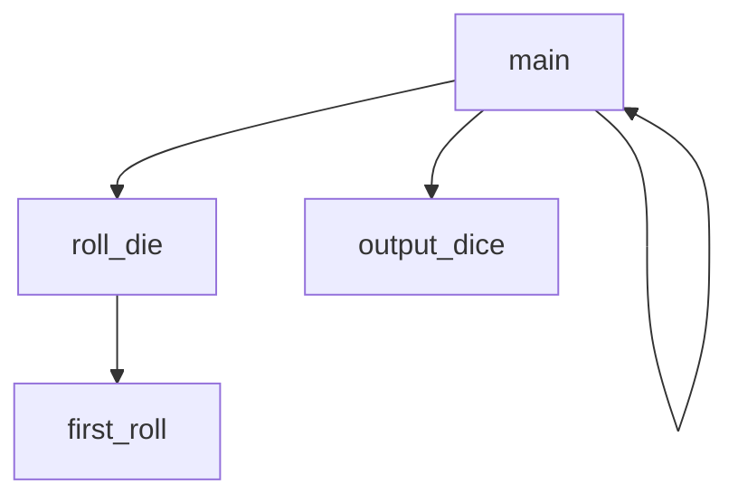

Program name: Ezee dice game
Brody Douglass, Oliver Albert

## <EzeeDiceGame> Description
The program is a dice simulation game. The goal is to role 12 dice as many times to get the same number.

### <EZEE dice game> Flowchart

#### Function Diagrams

| `main`    |               |  author  brody   |
| ------------------ | ------------- | ------------ |
| `argument:type`    | takes input from the user for nothing  |              |
| `time:integer`     | calculates roles  | outputs nothing             |
| `name:string`      | takes input for name none | returns total |
***
| `output_dice(dice)`    |               |     author brody   |
| ------------------ | ------------- | ------------ |
| `argument:type`    | takes input from the user for dice  |              |
| `time:integer`     | calculates dice  | outputs dice             |
| `name:string`      | takes input for name list | returns total |
***
| `first_role()`    |               |     author brody   |
| ------------------ | ------------- | ------------ |
| `argument:type`    | takes input from the user for none  |              |
| `time:integer`     | calculates 12 rolls  | outputs rolls           |
| `name:string`      | takes input for name count | returns total |
***
| `output_dice(dice)`    |               |     author brody   |
| ------------------ | ------------- | ------------ |
| `argument:type`    | takes input from the user for dice  |              |
| `time:integer`     | calculates dice  | outputs dice             |
| `name:string`      | takes input for name list | returns total |
***
| `count_frequency(dice, number)`    |               |     author brody   |
| ------------------ | ------------- | ------------ |
| `argument:type`    | takes input from the user for dice  |              |
| `time:integer`     | calculates dice ands number  | outputs frequency          |
| `name:string`      | takes input for name none | returns total |
***
| `find_mode(dice)`    |               |     author oliver  |
| ------------------ | ------------- | ------------ |
| `argument:type`    | takes input from the user for dice  |              |
| `time:integer`     | calculates dice  | outputs dice             |
| `name:string`      | takes input for name none2 | returns total |
***
| `list_unmatched_dice(dice)`    |               |     author oliver   |
| ------------------ | ------------- | ------------ |
| `argument:type`    | takes input from the user for dice  |              |
| `time:integer`     | calculates unmatched  | outputs none          |
| `name:string`      | takes input for name none | returns total |
***
| `reroll_one(dice, index)`    |               |     author oliver   |
| ------------------ | ------------- | ------------ |
| `argument:type`    | takes input from the user for dice and index  |              |
| `time:integer`     | calculates reroll | outputs reroll           |
| `name:string`      | takes input for none list | returns total |
***
| `reroll_many(dice)`    |               |     author oliver   |
| ------------------ | ------------- | ------------ |
| `argument:type`    | takes input from the user for dice values  |              |
| `time:integer`     | calculates reolls  | outputs rerolls            |
| `name:string`      | takes input for name list | returns total |
***

