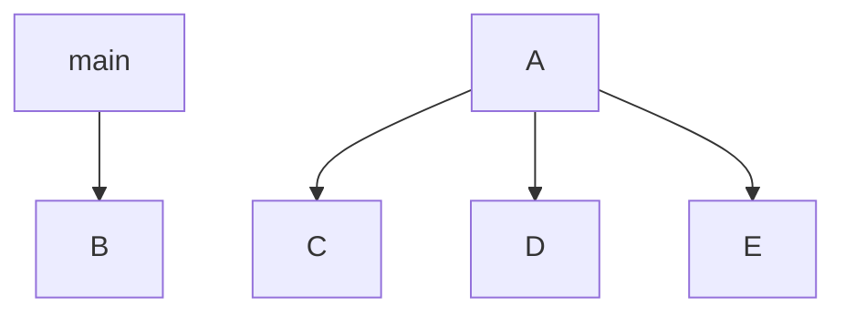

Function 1 (main): \Accepts no arguments Calls all functions to play the number of games specified
Function 2 (outputdice(dice)): Accepts dice Outputs each die in the list
Function 3 (roll_die): Accepts no arguments Returns a random integer from 1 to 6
Function 4 (first_roll):]Accepts no arguments Uses roll_die to generate a list of 12 integers Returns a list of 12 random integers
Function 5 (count_frequency(dice, number): Accepts a list of 12 random integers and a target value Returns how often that target value occurs in the list
Function 6 (find_mode(dice)): Accepts a list of dice. Uses count_frequency(dice, number) to determine how often each number occurs. Returns the mode
Function 7 (list_unmatched_dice(dice)): Accepts a list of dice Determines which dice need rerolled Returns a list of indexes to reroll
Function 8 (reroll_one(dice, index)): Accepts a list of dice and an index. Uses roll_die to reroll that index Returns a new list with that index rerolled
Function 9 (reroll_many(dice)): Accepts a list of dice Calls list_unmatched_dice() and reroll_one() to reroll each die != the mode. Returns a list of rerolled dice.

Program name: Ezee dice game
Brody Douglass, Oliver Albert

## <EzeeDiceGame> Description
The program is a dice simulation game. The goal is to role 12 dice as many times to get the same number.

### <program_name> Flowchart

#### Function Diagrams

| `main`    |               |  author  brody   |
| ------------------ | ------------- | ------------ |
| `argument:type`    | takes input from the user for nothing  |              |
| `time:integer`     | calculates roles  | outputs nothing             |
| `name:string`      | takes input for name none | returns total |
***
| `output_dice(dice)`    |               |     author brody   |
| ------------------ | ------------- | ------------ |
| `argument:type`    | takes input from the user for dice  |              |
| `time:integer`     | calculates dice  | outputs dice             |
| `name:string`      | takes input for name list | returns total |
***
| `first_role()`    |               |     author brody   |
| ------------------ | ------------- | ------------ |
| `argument:type`    | takes input from the user for none  |              |
| `time:integer`     | calculates 12 rolls  | outputs rolls           |
| `name:string`      | takes input for name count | returns total |
***
| `output_dice(dice)`    |               |     author brody   |
| ------------------ | ------------- | ------------ |
| `argument:type`    | takes input from the user for dice  |              |
| `time:integer`     | calculates dice  | outputs dice             |
| `name:string`      | takes input for name list | returns total |
***
| `count_frequency(dice, number)`    |               |     author brody   |
| ------------------ | ------------- | ------------ |
| `argument:type`    | takes input from the user for dice  |              |
| `time:integer`     | calculates dice ands number  | outputs frequency          |
| `name:string`      | takes input for name none | returns total |
***
| `find_mode(dice)`    |               |     author oliver  |
| ------------------ | ------------- | ------------ |
| `argument:type`    | takes input from the user for dice  |              |
| `time:integer`     | calculates dice  | outputs dice             |
| `name:string`      | takes input for name none2 | returns total |
***
| `list_unmatched_dice(dice)`    |               |     author oliver   |
| ------------------ | ------------- | ------------ |
| `argument:type`    | takes input from the user for dice  |              |
| `time:integer`     | calculates unmatched  | outputs none          |
| `name:string`      | takes input for name none | returns total |
***
| `reroll_one(dice, index)`    |               |     author oliver   |
| ------------------ | ------------- | ------------ |
| `argument:type`    | takes input from the user for dice and index  |              |
| `time:integer`     | calculates reroll | outputs reroll           |
| `name:string`      | takes input for none list | returns total |
***
| `reroll_many(dice)`    |               |     author oliver   |
| ------------------ | ------------- | ------------ |
| `argument:type`    | takes input from the user for dice values  |              |
| `time:integer`     | calculates reolls  | outputs rerolls            |
| `name:string`      | takes input for name list | returns total |
***

